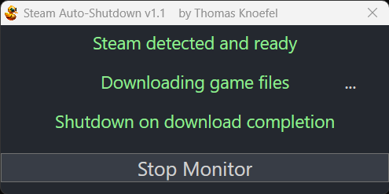

# Valve Steam Auto-Shutdown

Steam Auto-Shutdown is a utility that monitors Steam downloads and triggers a system shutdown when all downloads are completed. This tool is especially useful for users who want to leave their computer unattended while downloading large game files.

## Features

- Monitor Steam downloads in real-time
- Automatically shut down the computer when all downloads are completed
- User-friendly GUI to display the status of downloads and shutdown
- Log file to record the shutdown events

## Requirements

- Windows operating system
- .NET Framework installed (already installed by Windows)
- VSteam installed

## Installation and Usage

1. Download the repository as a ZIP file.
2. Extract the contents of the ZIP file to a directory on your computer.
3. Locate the `start_SteamAutoShutdown.bat` file in the extracted folder.
4. Double-click the `start_SteamAutoShutdown.bat` file to run the PowerShell script.

*Reminder: The `start_SteamAutoShutdown.bat` file will execute the `SteamAutoShutdown.ps1` script. If you encounter any issues with the script's execution, ensure that your PowerShell execution policy allows running scripts.*

## Note

Halted downloads are also detected as downloads in progress. If a download is detected but there is no visible download in progress, please check for stopped downloads and clean them up by uninstalling or finishing the download.

## Contributing

Pull requests are welcome. For major changes, please open an issue first to discuss what you would like to change.

## License

[MIT](https://choosealicense.com/licenses/mit/)
